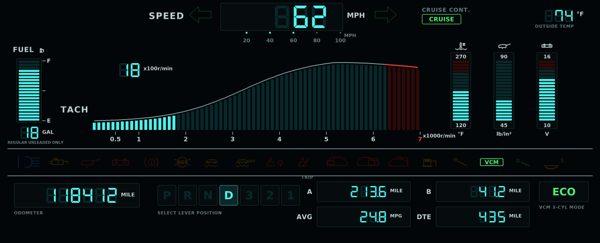

# pygame-sandbox

Digital instrument cluster experiments in pygame.

## Projects

| File | Cluster |
| --- | --- |
| `odyssey_dash.py` | 2006 Honda Odyssey, styled after a 1985 Nissan 300ZX digital dash |
| `dashboard.py` | 1980s VW Digifiz, using the asset set from the Digifiz-Dash project |
| `toyota_cressida.py` | 1982 Toyota Cressida TRONIX cluster, drawn procedurally |
| `seven_segment.py` | Minimal animated 7-segment digit demo |
| `hello.py` | Minimal pygame "hello world" |

## Setup

The `.venv/` in this repo already has pygame installed. Activate it:

```bash
source .venv/bin/activate
python odyssey_dash.py
```

Or call the venv interpreter directly, without activating:

```bash
.venv/bin/python odyssey_dash.py
```

Note that this box has `python3` but no `python` on `$PATH`, so `python` only
works once the venv is active. To build the venv from scratch:

```bash
python3 -m venv .venv
source .venv/bin/activate
pip install -r requirements.txt
```

## Odyssey cluster



The Odyssey dash is built as a three-stage asset pipeline rather than a single
script, which keeps the artwork separate from the vehicle logic.

```
odyssey_layout.py           design data: palette, canvas size, every coordinate
        |
        v
tools/gen_odyssey_assets.py draws PNGs at 3x and downsamples for antialiasing
        |
        v
assets/odyssey/             background stencil + all animation frames
        |
        v
odyssey_dash.py             composites frames over a live vehicle simulation
```

`odyssey_layout.py` is the single source of truth: the generator and the
runtime both import their coordinates from it, so a position is never
duplicated. Change a number there and both sides follow.

The assets are committed, so you can run the dash straight away. Only re-run
the generator after editing `odyssey_layout.py` or the generator itself.

```bash
python odyssey_dash.py                 # native 1280x520
python odyssey_dash.py --scale 0.75    # smaller window

python tools/gen_odyssey_assets.py     # rebuild assets/odyssey/ (~820 KB, 186 PNGs)
```

### Generated assets

| Path | Contents |
| --- | --- |
| `background.png` | Static stencil: bezels, silkscreen labels, scales, printed tach envelope, dim ghost segments, unlit lamp glyphs |
| `tach/tach_NN.png` | 71 bar-graph frames, 0-7000 rpm in 100 rpm steps, redline bars above 6300 |
| `bars/<name>_NN.png` | 21 frames each for fuel, coolant temp, oil pressure, voltmeter |
| `lamps/<key>.png` | Lit indicator glyphs, turn arrows, CRUISE and ECO badges, speed pip |
| `gear/gear_N.png` | Lit P-R-N-D-3-2-1 selector cells |

Every frame is drawn to overlay its dim counterpart on the background exactly,
so the runtime only ever blits: no per-frame geometry math.

### Simulated vehicle

Modelled on an Odyssey EX-L: J35A7 3.5 V6, 5-speed automatic (2.652 / 1.517 /
1.037 / 0.738 / 0.566, 4.312 final drive, 235/65R16), 21.0 gal tank, 6300 rpm
redline, Variable Cylinder Management.

Derived live: gear selection with shift hysteresis, coolant warm-up, oil
pressure vs. rpm, charging voltage, road-load fuel burn (BSFC-style) feeding
instant mpg / average mpg / distance-to-empty, odometer and dual trip meters,
traction loss triggering VSA, and VCM engagement at light cruise.

### Controls

| Keys | Action |
| --- | --- |
| `UP` | Throttle (hold) |
| `DOWN` / `SPACE` | Brake (hold) |
| `C` | Cruise control (set at current speed, needs 25+ mph in D) |
| `X` | Engine start / stop |
| `P` `R` `N` `D` `3` `2` `1` | Selector lever position |
| `LEFT` / `RIGHT` | Turn signals |
| `B` | High beam |
| `L` | Lamp test — lights everything (hold) |
| `M` `A` `V` `S` `Z` | Check engine, ABS, VSA OFF, SRS, seatbelt |
| `O` `K` `G` `W` `J` `E` `Y` | Door, sliding door, tailgate, washer, maintenance, park brake, security |
| `Q` / `SHIFT+Q` | Refuel / drain to 2 gal |
| `T` / `SHIFT+T` | Reset trip A / trip B |
| `F1` | Toggle on-screen control list |
| `ESC` | Quit |

Low fuel, oil pressure, charging, VSA activity and VCM lamps are driven by the
simulation rather than keys.

### Probing a real vehicle

`tools/probe_obd.py` answers the two questions that decide how a real
installation has to be built: which signals the van can actually supply, and
how many values per second the bus delivers. The second matters more than
people expect — a 2006 Odyssey is most likely ISO 9141-2 (10.4 kbaud K-line),
where an ELM327 delivers roughly 5-20 requests per second *in total across
every PID*, not per PID.

```bash
.venv/bin/python tools/probe_obd.py --mock          # simulated van, no hardware
.venv/bin/python tools/probe_obd.py --list-ports    # find the adapter
.venv/bin/python tools/probe_obd.py                 # auto-detect port and baud
.venv/bin/python tools/probe_obd.py --port /dev/ttyUSB0 --json obd_report.json
```

It reports the negotiated protocol, decodes the supported-PID bitmasks, reads
and decodes every PID this cluster needs, measures single-PID and round-robin
throughput, and prints a readiness table mapping all 19 renderer fields to a
source. Run the engine while probing. `--mock` simulates a 2006 Honda with
realistic K-line latency, so the whole tool is testable at a desk.

Signals that no OBD-II PID provides — turn signals, high beam, doors, park
brake, gear selector — need opto-isolated taps off the factory 12V lamp
circuits. Oil pressure has no source at all on this engine (it has a switch,
not a sender), so either fit an aftermarket sender or repurpose that bar as
manifold pressure from PID `0x0B`.

## VW Digifiz cluster

`dashboard.py` renders the VW Digifiz layout using the artwork in
`assets/digifiz/` (background, 51 curved tach frames, 20 aux-gauge frames,
indicator sprites, DSEG-7 font), sourced from the
[Digifiz-Dash](https://github.com/gfunkbus76) project. It renders at the
native 1920x720 and scales down to fit the window. See the module docstring
for its key bindings.
